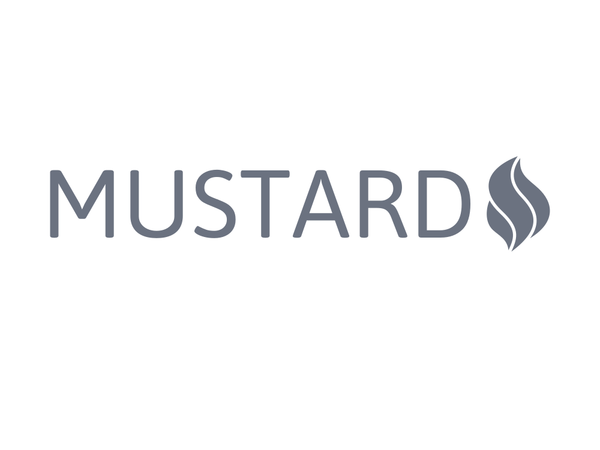

<p align="center">

</p>


[](https://codecov.io/gh/LinbuduLab/Mustard)

> **This is an incubating project of [@LinbuduLab](https://github.com/LinbuduLab), which also means it's still under development.**

IoC & [Native ECMAScript Decorator](https://github.com/tc39/proposal-decorators) based command line app builder.

## Requires

- Node.js >= 16.0.0
- TypeScript >= 5.0.0

Before TypeScript 5.0 is released, you will need to configure the used TypeScript version like below in `.vscode/settings.json`:

```json
{
  "typescript.tsdk": "node_modules/typescript/lib"
}
```

## Resources

- If you want to know more about the usage of new decorators(using TypeScript or Babel), please refer to [with-new-decorators](https://github.com/linbudu599/with-new-decorators).
- For the development progress of the new decorators, please refer to [#50820](https://github.com/microsoft/TypeScript/pull/50820) and more issues.
- Also, please check the [5.0 Iteration Plan](https://github.com/microsoft/TypeScript/issues/51362) for more information.

## Features

- Born to be type safe
- Nest command support
- Validator support by [Zod](https://github.com/colinhacks/zod)
- Automatic usage info generation
- Build decoupled applications using IoC concepts
- Essential built-in utils for CLI app

## Getting Started

- [Documentation](https://mustard-cli.netlify.app/)

> Complete documentation will be provided after TypeScript 5.0 is officially released.

```bash
$ npm i typescript@beta
$ npm i mustard-cli
```

You can find more samples in [Samples](packages/sample/samples/).

```typescript
#!/usr/bin/env node

import { MustardFactory } from "mustard-cli";
import {
  Command,
  RootCommand,
  Option,
  VariadicOption,
  App,
  Input,
} from "mustard-cli/decorator";
import { Validator } from "mustard-cli/validator";
import { CommandStruct, MustardApp } from "mustard-cli/cli";

import path from "path";

@RootCommand()
class RootCommandHandle implements CommandStruct {
  @Option("m")
  public msg = "default value of msg";

  public run(): void {
    console.log(`Root command executed with: msg: ${this.msg}`);
  }
}

@Command("update", "u", "update project dependencies")
class UpdateCommand implements CommandStruct {
  @Option("depth", "depth of packages to update", Validator.Number().Gte(1))
  public depth = 10;

  @Option(Validator.Boolean())
  public dry = false;

  @Option({ name: "target", alias: "t" })
  public targetOption: string;

  @Input()
  public input: string[] = [];

  @VariadicOption()
  public packages: string[] = [];

  public run(): void {
    console.log(
      `Update command executed with: depth: ${this.depth}, dry: ${
        this.dry
      }, targetOption: ${this.targetOption}, input: ${JSON.stringify(
        this.input
      )}, packages: ${JSON.stringify(this.packages)}`
    );
  }
}

@App({
  name: "LinbuduLab CLI",
  commands: [RootCommandHandle, UpdateCommand],
  configurations: {
    allowUnknownOptions: true,
    enableVersion: require(path.resolve("./package.json")).version,
  },
})
class Project implements MustardApp {
  onStart() {}

  onComplete() {}
}

MustardFactory.init(Project).start();
```

```bash
$ cli
# Root command executed with: msg: default value of msg
$ cli -m
# Root command executed with: msg: hello
$ mm update
# Update command executed with: depth: 10, dry: false, targetOption: undefined, input: [], packages: []
$ mm update --depth=1 --target=dep --packages p1 p2 p3
# Update command executed with: depth: 1, dry: false, targetOption: dep, input: [], packages: ["p1","p2","p3"]
$ mm update p1 p2 p3 -t=dev
# Update command executed with: depth: 10, dry: false, targetOption: dev, input: ["p1","p2","p3"], packages: []
```

## License

[MIT](LICENSE)
