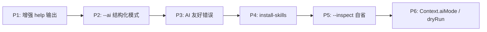

# AI-Friendly CLI App Builder 计划

## 核心思路

AI 代理（Claude Code / Codex CLI / Cursor Agent 等）使用 CLI 工具的典型链路是：

```
读取 --help → 理解参数/约束 → 构造命令 → 执行 → 解析 stdout/stderr → 决策下一步
```

Mustard 作为 **框架层**，应在每个环节都提供"对 AI 更友好"的默认行为，而不需要下游开发者额外编码。

---

## 一、增强 `--help` 输出：让 AI 一次读懂命令全貌

当前 `UsageInfoGenerator` 输出的信息**不完整**（缺少校验规则、约束值、必填标记、类型提示、示例），AI 代理需要多次试错才能推断参数约束。

### 1.1 在 Option 行展示类型与校验约束

当前输出：

```
Options:
  --port, -p, server port, default: 3000
```

目标输出：

```
Options:
  --port, -p  <number>  server port  [default: 3000] [required] [>= 1, <= 65535]
  --host      <string>  server host  [default: "localhost"] [startsWith: "http"]
  --dry, -d   <boolean> dry run mode [default: false]
```

**实现思路**：

- 在 `collectSpecificCommandUsage` 阶段，从 `OptionInitializerPlaceHolder` 上提取 `schema`（Zod schema）和 `restrictValues`。
- 新增工具函数 `describeSchema(schema: ZodType): string`，递归遍历 Zod 内部 `_def.checks` 数组，提取 `min/max/startsWith/endsWith/email/int/positive` 等约束并格式化为 `[>= 1, <= 65535]` 风格的人类/AI 可读文本。
- 从 `schema.isOptional()` 推断必填，输出 `[required]` 标记。
- 类型推断：String/Number/Boolean/Enum 各 validator 创建时可在 schema 上挂元数据标签，或在 `ValidatorFactory` 里记录 `_typeName`，格式化时输出 `<number>` / `<string>` / `<boolean>` / `<enum: Foo|Bar|Baz>`。

**关键文件**：

- 新建 `source/Components/SchemaDescriber.ts`
- 修改 `source/Components/UsageGenerator.ts`（`collectSpecificCommandUsage` 和格式化函数）
- 修改 `source/Validators/PrimitiveValidators.ts` 和 `source/Validators/EnumValidators.ts`（附加类型标签到 schema）

### 1.2 展示 `@Restrict` 约束值

当前：不展示。目标：

```
  --env <string>  target environment  [default: "dev"] [allowed: "dev" | "staging" | "prod"]
```

**实现思路**：`collectSpecificCommandUsage` 阶段读取字段占位上的 `restrictValues`，格式化为 `[allowed: ...]`。

### 1.3 展示 `@VariadicOption` 的可重复语义

```
  --files, -f  <string[]>  files to process  [default: []] [repeatable]
```

### 1.4 自动生成 Examples 段落

在 `@Command` / `@RootCommand` 上新增可选 `examples` 配置：

```typescript
@Command({
  name: "deploy",
  alias: "d",
  description: "deploy to cloud",
  examples: [
    "deploy --env staging --dry",
    "deploy --env prod --files a.ts b.ts",
  ],
})
```

格式化时在 Options 段之后附加：

```
Examples:
  $ mm deploy --env staging --dry
  $ mm deploy --env prod --files a.ts b.ts
```

若开发者未提供 `examples`，框架可基于已声明的 Option 默认值 **自动拼一条**（"auto-example"）：将所有有默认值或 restrict 的选项组装成一行命令示例。

**关键类型**：扩展 `CommandConfiguration`（`source/Typings/Command.struct.ts`）增加 `examples?: string[]`。

### 1.5 有 Root 时顶层 `--help` 同时列出并列子命令

当前 `formatRootCommandUsage` **不展示子命令列表**，AI 代理在 `mm --help` 时看不到有哪些子命令可用。

修改 `printHelp` 逻辑：当 registration 为 root 时，额外从 `CommandRegistry.provide()` 收集非 root 的命令一并附在 Root usage 下方，形如：

```
Commands:
  deploy, d   deploy to cloud
  config, c   manage configuration

Run 'mm <command> --help' for more information on a specific command.
```

---

## 二、自动注册 `--ai` 全局 Flag 与机器可读输出模式

AI 代理更擅长处理**结构化**输出。Mustard 框架层可以内置一个 `--ai` 全局 flag，切换输出格式。

### 2.1 `--ai` Flag 激活结构化帮助

当同时传入 `--help --ai` 时，不走人类友好的文本格式，而是输出一段 **JSON Schema 风格** 的结构化描述：

```json
{
  "name": "deploy",
  "description": "deploy to cloud",
  "options": [
    {
      "name": "env",
      "alias": "e",
      "type": "string",
      "required": true,
      "default": "dev",
      "allowed": ["dev", "staging", "prod"],
      "description": "target environment"
    },
    {
      "name": "port",
      "type": "number",
      "constraints": { "gte": 1, "lte": 65535 },
      "default": 3000
    }
  ],
  "examples": ["deploy --env staging --dry"],
  "subcommands": ["config", "migrate"]
}
```

**实现思路**：

- 在 `MustardConstanst` 新增 `InternalAIFlag = "MUSTARD_AI_FLAG"`。
- `BuiltInCommands` 检测到 `--ai` 时，收集完整 usage 数据结构，`JSON.stringify` 输出到 stdout，`process.exit(0)`。
- 这样 AI 代理可以 `mm --help --ai | jq .options` 精准获取参数信息。

### 2.2 `--ai` Flag 激活结构化错误

当 `--ai` 存在时，所有框架层错误（ValidationError、CommandNotFoundError 等）改为输出 JSON：

```json
{
  "error": "ValidationError",
  "field": "port",
  "received": "abc",
  "expected": "number",
  "constraints": { "gte": 1, "lte": 65535 },
  "suggestion": "Provide a number between 1 and 65535"
}
```

这比当前的 `throw` + Node 默认堆栈对 AI 代理有用得多。

---

## 三、自动添加 `install-skills` 子命令

Claude Code / Cursor 等支持 Skills / AGENTS.md 机制。Mustard 框架可以内置一个 `install-skills` 命令，为当前工作目录生成一份 **Skill 描述文件**（Markdown），让 AI 代理在使用该 CLI 工具前自动"学会"它。

### 3.1 Skill 文件内容

自动生成的 Skill 文件应包含：

- 工具名称、版本、简介
- 所有命令及其完整参数签名（复用 1.1 的增强信息）
- 每个命令的 examples
- 典型 workflow（如果开发者通过配置提供了的话）
- 错误码与含义
- 安装/配置前置条件

### 3.2 实现思路

- 新增内置命令类 `InstallSkillsCommand`，注册为 `install-skills`。
- 运行时收集 `CommandRegistry` 中所有命令元数据 + `UsageInfoGenerator` 增强后的结构化信息。
- 生成 Markdown 写入 `.cursor/skills/<tool-name>/SKILL.md` 或 `.claude/AGENTS.md`（可通过参数选择目标格式）。
- 在 `@App` 配置中新增 `aiSkills?: { version?: string; workflows?: string[] }` 允许开发者补充高阶信息。

### 3.3 配置扩展

```typescript
@App({
  name: "my-cli",
  commands: [...],
  configurations: {
    aiSkills: {
      version: "1.2.0",
      description: "A deployment tool for cloud infrastructure",
      workflows: [
        "To deploy: first run `my-cli config set-env staging`, then `my-cli deploy --dry`, review output, then `my-cli deploy`",
      ],
    },
  },
})
```

---

## 四、AI 友好的错误系统增强

### 4.1 错误信息结构化与建议

当前错误类只有 `message`。扩展所有 Error 类增加 `suggestion` 字段：

| Error                  | 当前 message                                  | 增加 suggestion                                                               |
| ---------------------- | --------------------------------------------- | ----------------------------------------------------------------------------- |
| `ValidationError`      | "Expected string, received number"            | "Option --port expects a number. Run `mm deploy --help` to see valid values." |
| `CommandNotFoundError` | "Command not found with parsed args: ..."     | "Available commands: deploy, config. Run `mm --help` to see all commands."    |
| `DidYouMeanError`      | "Unknown option --helo, did you mean --help?" | 已有建议，保持                                                                |
| `UnknownOptionsError`  | "Unknown options: foo"                        | "Run `mm <command> --help` to see available options."                         |

### 4.2 exitCode 规范化

定义不同错误类别的 exit code（而非统一 exit 1），便于 AI 代理按 exit code 分类处理：

- `0`：成功
- `1`：运行时错误（handler.run 抛出）
- `2`：参数校验错误（ValidationError）
- `3`：命令未找到（CommandNotFoundError）
- `4`：配置错误（NullishFactoryOptionError 等）

在 `CLI.handleCommandExecution` 的 catch 和 `dispatchRootHandler/dispatchCommand` 中统一 `process.exit(code)`。

---

## 五、自省命令 `--inspect`

新增内置全局 flag `--inspect`，输出当前 CLI 的完整元数据（JSON），供 AI 代理在首次交互时一次性获取全部信息：

```bash
mm --inspect
```

输出：

```json
{
  "name": "my-cli",
  "version": "1.2.0",
  "commands": [
    {
      "name": "deploy",
      "alias": "d",
      "root": false,
      "description": "deploy to cloud",
      "options": [...],
      "subcommands": [...],
      "examples": [...]
    }
  ],
  "globalFlags": ["--help", "--version", "--ai", "--inspect"],
  "skills": { ... }
}
```

和 `--help --ai` 的区别：`--inspect` 是 **全应用级**一次性 dump，适合 AI 首次"学习"整个工具；`--help --ai` 是 **单命令级**，适合执行前精确查询。

---

## 六、其他值得支持的 AI 友好特性

### 6.1 `--output-format` 全局 flag

让**开发者的命令 handler** 也能感知 AI 模式。框架在 `@Ctx()` 注入的 Context 中增加 `aiMode: boolean` 和 `outputFormat: "text" | "json"` 字段，开发者可据此在 `run()` 中切换输出格式：

```typescript
public run(): void {
  if (this.ctx.aiMode) {
    console.log(JSON.stringify(this.result));
  } else {
    console.log(formatTable(this.result));
  }
}
```

### 6.2 命令执行的 dry-run 协议

在框架层约定 `--dry-run` 全局 flag，开发者在 `run()` 中可通过 `this.ctx.dryRun` 获取。AI 代理在不确定时可先 `--dry-run` 试探，再决定是否真正执行。

### 6.3 命令发现接口 `--commands`

类似 `--inspect` 但更轻量，只输出命令名列表（一行一个），AI 代理可快速枚举可用命令：

```bash
mm --commands
# deploy
# config
# migrate
```

---

## 优先级建议



- **P1（增强 help）** 是基础，后续所有结构化输出都复用同一份"增强后的元数据收集"。
- **P2（--ai flag）** 依赖 P1 的数据结构。
- **P3（错误增强）** 可独立推进，但 `--ai` 模式下的 JSON 错误输出依赖 P2。
- **P4（install-skills）** 依赖 P1+P2 的完整元数据。
- **P5/P6** 为锦上添花，优先级可后置。
