# Mustard CLI 内部处理流程

本文档基于 `packages/sample` 下的几种 CLI 应用构建方式，梳理 mustard-cli 框架从装饰器元数据采集到命令执行的完整内部流程。

---

## 目录

- [总体架构](#总体架构)
- [阶段一：装饰器元数据采集](#阶段一装饰器元数据采集)
  - [命令注册 @Command / @RootCommand](#命令注册)
  - [选项注册 @Option / @VariadicOption / @Options](#选项注册)
  - [输入注册 @Input](#输入注册)
  - [依赖注入 @Inject / @Provide](#依赖注入装饰器)
  - [控制器 @Restrict](#控制器装饰器)
- [阶段二：应用引导](#阶段二应用引导)
- [阶段三：命令分发与执行](#阶段三命令分发与执行)
- [阶段四：字段归一化](#阶段四字段归一化)
- [示例模式详解](#示例模式详解)
  - [模式一：全功能应用 (index.mts)](#模式一全功能应用)
  - [模式二：通用模式 (Common.ts)](#模式二通用模式)
  - [模式三：嵌套子命令 (Nested.ts)](#模式三嵌套子命令)
  - [模式四：依赖注入 (WithCustomProviders.ts)](#模式四依赖注入)

---

## 总体架构

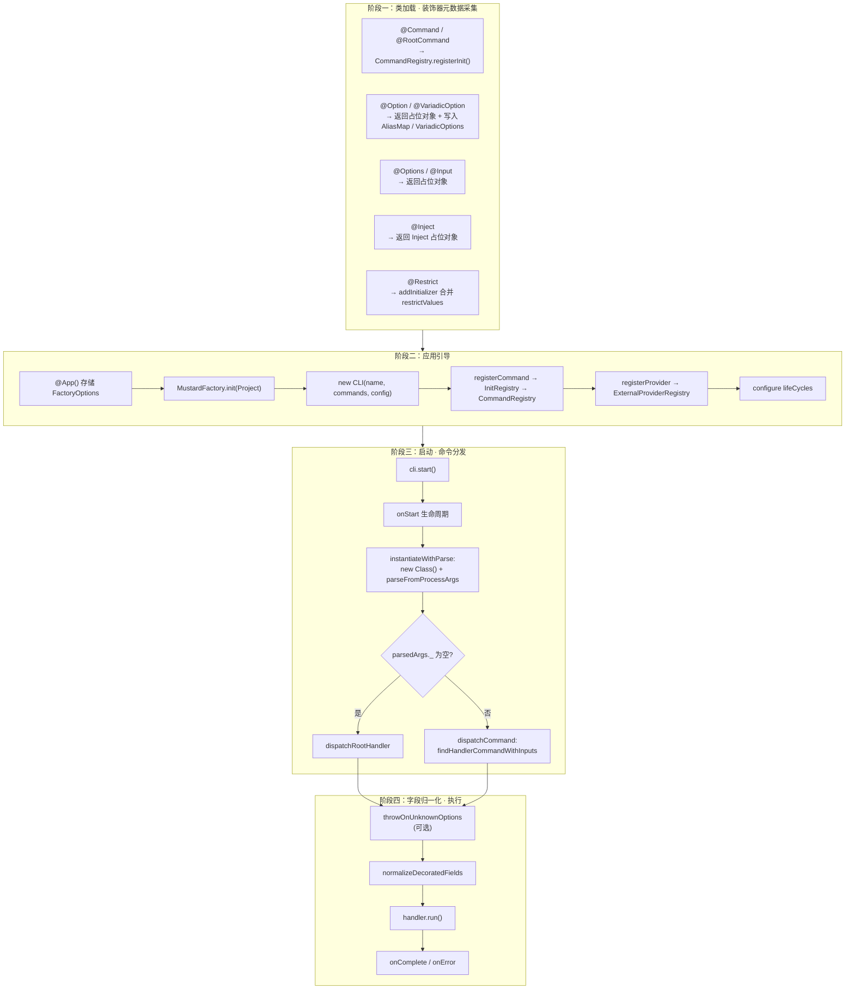

---

## 阶段一：装饰器元数据采集

### 命令注册

`@Command` 和 `@RootCommand` 在类加载时将命令元数据写入 `CommandRegistry.InitCommandRegistry`。

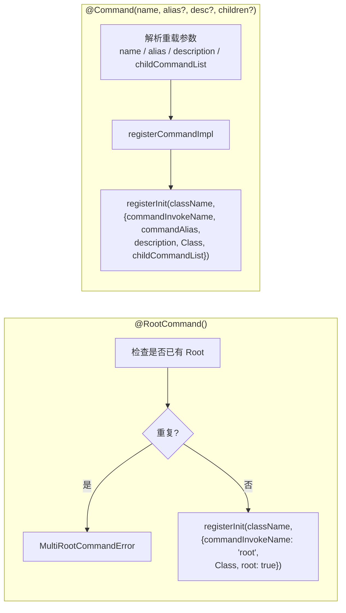

**别名判定规则**：当第二个字符串参数长度 ≤ 2 时视为 alias，否则视为 description。

### 选项注册

`@Option` / `@VariadicOption` / `@Options` 都通过**字段装饰器初始化函数**返回带有 `type` 标记的占位对象，同时在全局注册表中记录别名和可变参数信息。

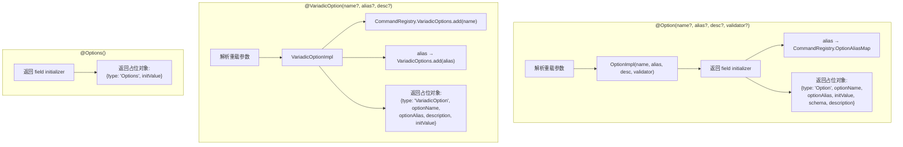

### 输入注册

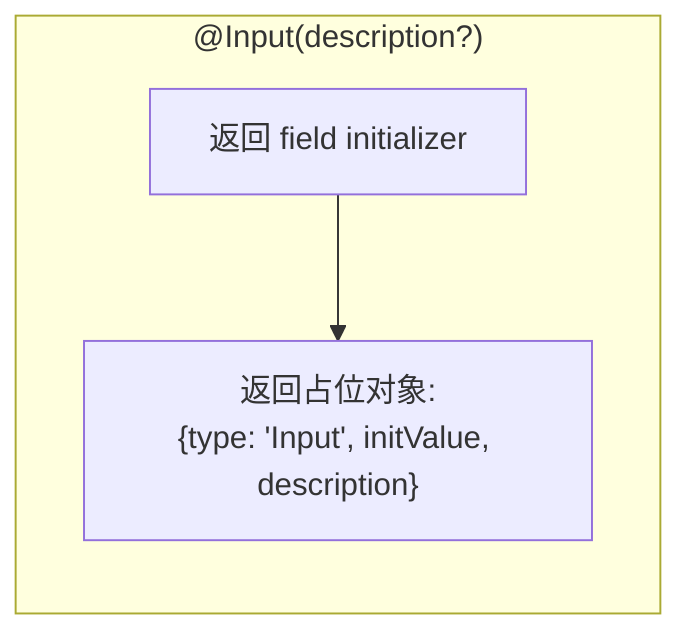

### 依赖注入装饰器

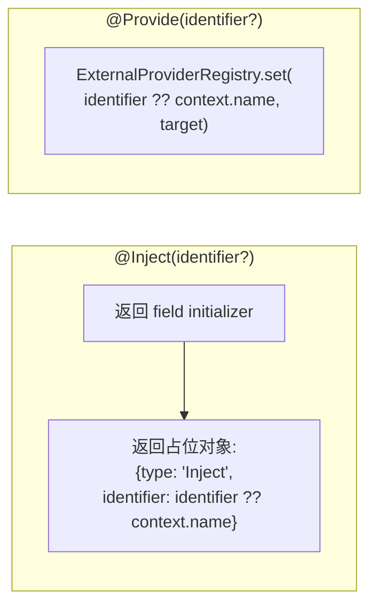

### 控制器装饰器

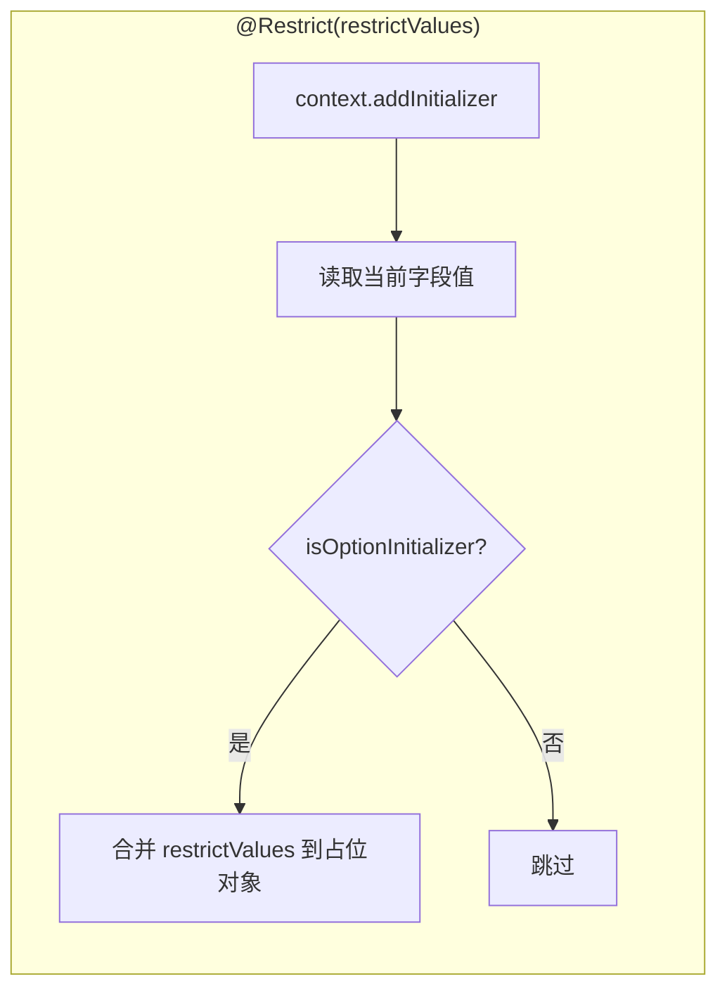

---

## 阶段二：应用引导

`@App` 装饰器仅存储配置，`MustardFactory.init()` 才真正启动应用构建。

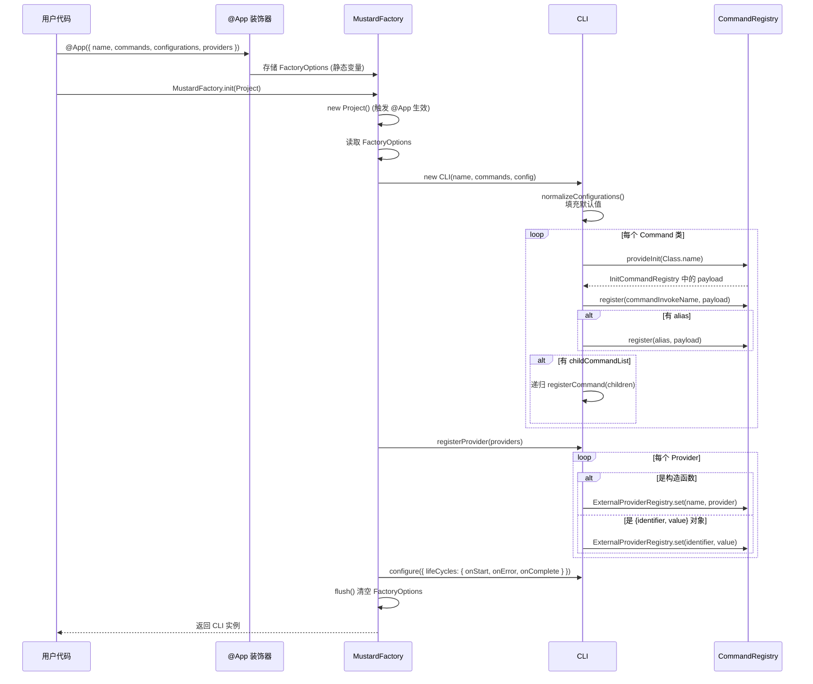

---

## 阶段三：命令分发与执行

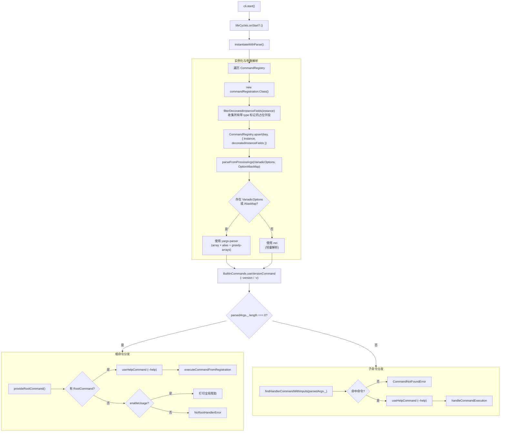

### 子命令匹配算法

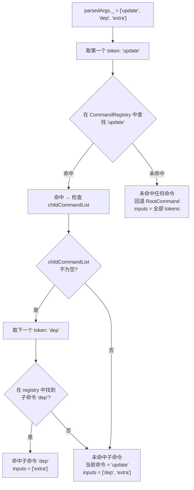

---

## 阶段四：字段归一化

`DecoratedClassFieldsNormalizer.normalizeDecoratedFields` 根据占位对象的 `type` 分发到不同的归一化策略。

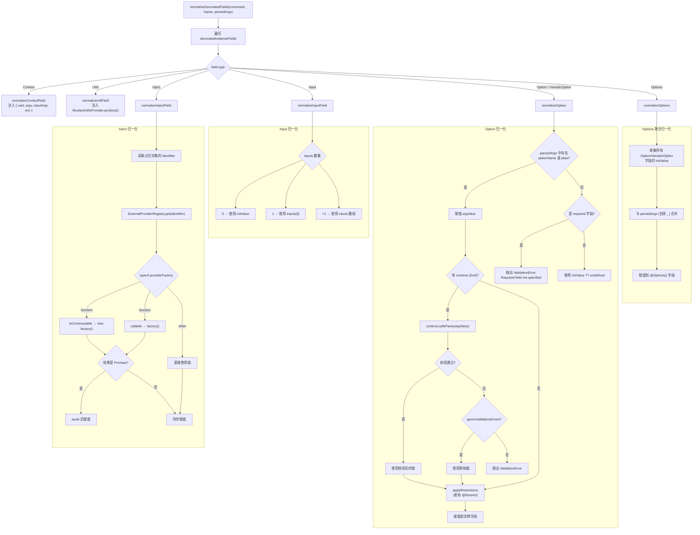

---

## 示例模式详解

### 模式一：全功能应用

**对应文件**: `index.mts`

**特征**: RootCommand + 多个子命令 + Validator 校验链 + Input + VariadicOption + enableUsage/enableVersion

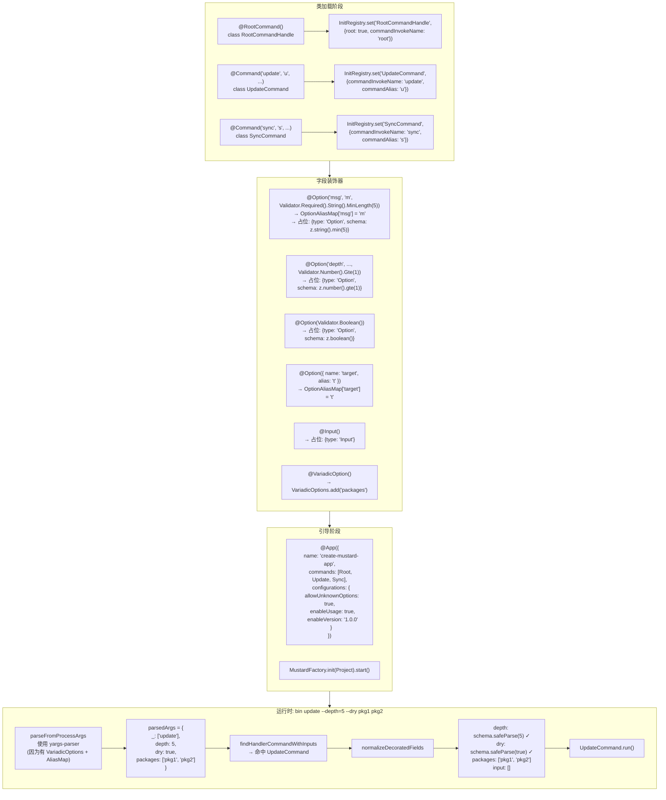

### 模式二：通用模式

**对应文件**: `samples/Common.ts`

**特征**: @Options() 聚合全部选项 + shebang 脚本入口

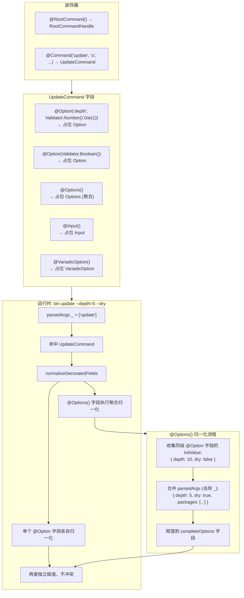

### 模式三：嵌套子命令

**对应文件**: `samples/Nested.ts`

**特征**: `@Command(name, childCommandList)` 构建命令树

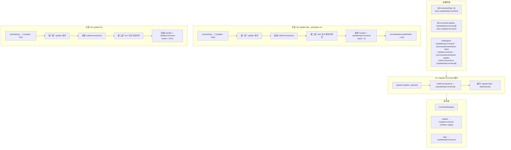

### 模式四：依赖注入

**对应文件**: `samples/WithCustomProviders.ts`

**特征**: `@Inject` + `providers` 配置实现服务注入

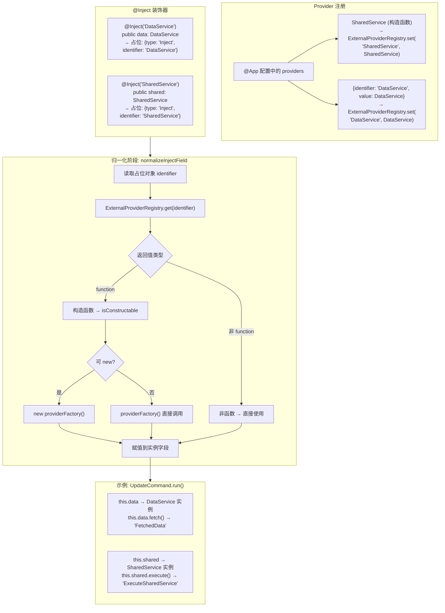

---

## 参数解析器选择策略

mustard-cli 内部根据是否注册了 `VariadicOption` 或 `OptionAlias` 来选择不同的参数解析器：

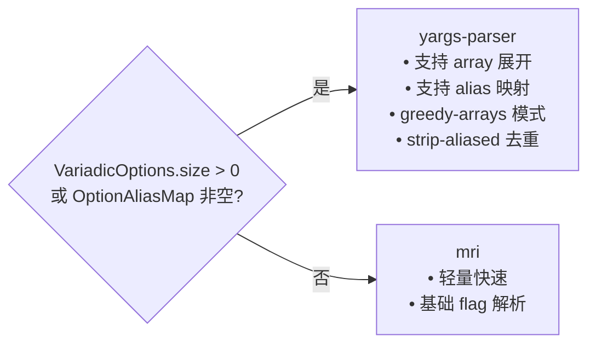

## 完整生命周期时序

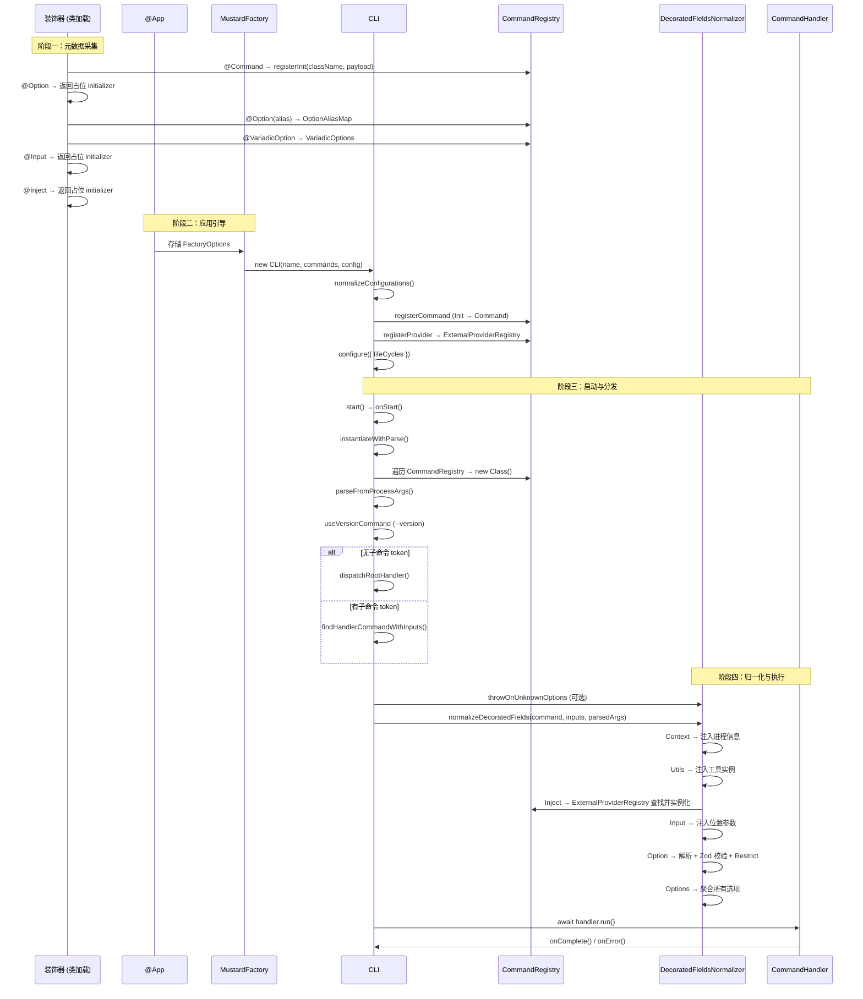
